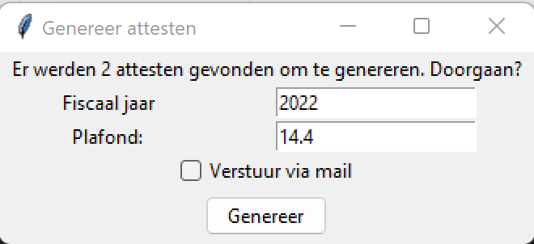

## AttestCreator
### Over
Jeugdorganisaties zijn vanaf inkomstenjaar 2022 verplicht zijn om [fiscale attesten](https://financien.belgium.be/nl/E-services/Belcotaxonweb/technische-documentatie) 
voor de terugbetaling van kinderopvang te voorzien. Niemand heeft zin in veel extra administratief werk,
vandaar deze tool om de attesten makkelijker te genereren en door te sturen. AttestCreator genereert de attesten 
op basis van een excelsheet met ledendata en opgegeven info over het fiscale jaar, waarna alle nodige pdf's worden 
aangemaakt (en doorgestuurd indien gewenst). Na aanvullingen door de ouder/voogd kan het attest ondertekend worden.

De attesten moeten ook aangegeven worden bij FOD Financiën, waarvoor een KBO-nummer nodig is.
Feitelijke verenigingen moeten hiervoor [een aanvraag doen](https://financien.belgium.be/nl/E-services/Belcotaxonweb/hoe-toegang-krijgen-tot-belcotax-on-web#q3).
Daarna kan met behulp van [BowConverter](https://financien.belgium.be/sites/default/files/downloads/161-BowConvert86-2022.zip)
de data worden omgezet in een XML en de aanvraag gedaan worden. Om de teruggestuurde pdf's te vertalen naar het formaat 
gebruikt in BowConverter zal een aparte tool voorzien worden tegen het einde van dit fiscale jaar.

### Configuratie
Download de laatste release [hier](https://github.com/rokeppen/attestCreator/releases/download/v1/v1.zip) 
(mogelijks volgen meldingen over onveilige bestanden). Vul vervolgens de gegevens van de vereniging aan in de volgende bestanden:
#### ```lijst.xlsx```
De ledenlijst met de data van het kind die de vereniging ter beschikking heeft.
Voor elke rij wordt een attest gecreëerd met de niet-lege periodes.
Het opgegeven e-mailadres is het contactadres van de ouders waar het attest naartoe kan gestuurd worden.
Enkel de tab "Gefilterd" wordt gebruikt.
#### ```instance.ini```
Data van de vereniging, ingevuld in vak I van het attest. In de release staat de voorbeelddata 
voor Scouts & Gidsen Lebbeke aangevuld, vraag zeker de correcte gegevens op bij de gemeente.
#### ```smtp.ini```
Indien de attesten automatisch dienen doorgestuurd te worden, moet hier de mailconfiguratie aangevuld worden.
Er wordt gebruik gemaakt van een uitgaande SMTP-server. Voor Gmail-gebruikers met tweestapsverificatie is een 
[app-paswoord](https://support.google.com/accounts/answer/185833) nodig, bij de meeste andere providers werkt de gebruikelijke login.
#### ```mailTemplate.html```
Dit is de standaard opmaak van de mail die wordt gestuurd naar de ouders, waarbij de naam en de gegevens van de vereniging
worden aangevuld in de velden tussen accolades:
- {0}: De voornaam van het kind
- {1}: Het fiscale jaar
- {2}: Het reply-to-mailadres opgegeven in ```smtp.ini```
- {3}: De naam van de vereniging opgegeven in ```instance.ini```

Wijzig dit template om de inhoud van deze mails te veranderen.

### Gebruik
#### GUI executable
Start de tool door te dubbelklikken op ```create.exe``` (Windows) of ```create.sh``` (Linux/Mac). 
Het volgende venster komt dan tevoorschijn:



Het aantal rijen teruggevonden in de excel wordt weergegeven. Hier kan ook het fiscale jaar, ingevuld in vak I 
en in de titel van het attest, aangevuld worden, samen met het gebruikte prijsplafond voor 1 dag opvang van dat jaar. 
Het huidige jaar en €14,4 (fiscaal jaar 2022) worden standaard ingevuld. Wanneer het vinkje "verstuur via mail" wordt gebruikt,
worden de attesten gemaild naar de adressen opgegeven in kolom 1. Rijen waarvoor geen e-mail werd opgegeven, worden overgeslagen.
Bij succes wordt een popup weergegeven, die bij het wegklikken de tool afsluit.

#### CLI
De basisfunctionaliteit is beschikbaar via het python-script ```generate.py``` met de volgende syntax:
```
python generate.py -p <path-to-pdf> -l <path-to-excel> -y <fiscal-year> -r <max-reimbursement-rate>
```

### Aanpassingen
Deze tool is enerzijds geschreven om mijn Python wat af te stoffen en anderzijds om onze scoutsgroep later werk te besparen.
Noch de code, noch de info hier opgelijst zullen vrij zijn van fouten, dus voel je vrij om aanpassingen/verbeteringen te doen :)
> Never spend 6 minutes doing something by hand when you can spend 6 hours failing to automate it.
