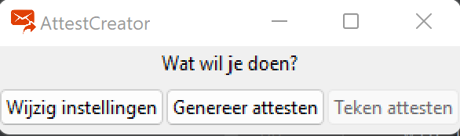
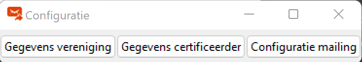
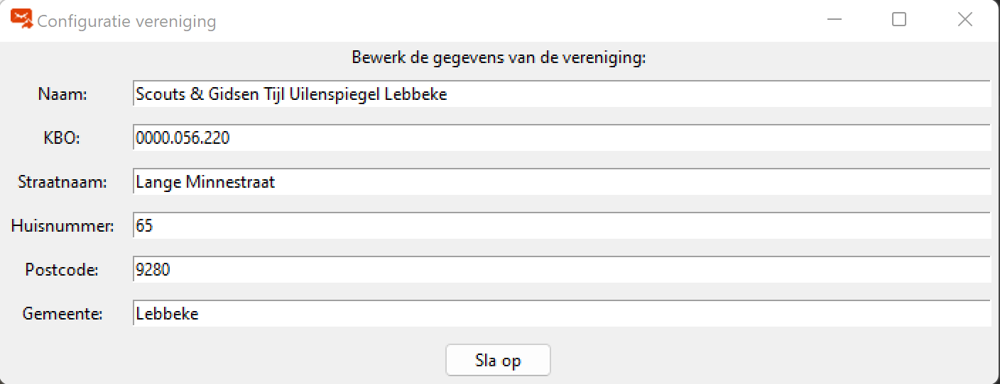
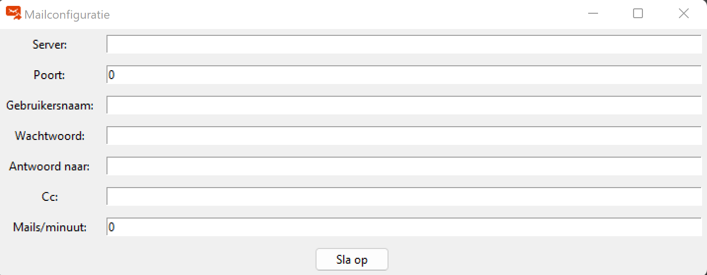
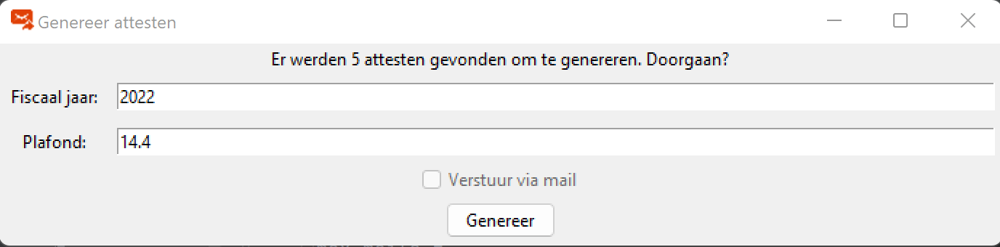
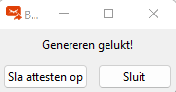

## AttestCreator
### Over
Jeugdorganisaties zijn vanaf inkomstenjaar 2022 verplicht om [fiscale attesten](https://financien.belgium.be/nl/E-services/Belcotaxonweb/technische-documentatie) 
voor de terugbetaling van kinderopvang te voorzien. Niemand heeft zin in veel extra administratief werk,
daarom deze tool om de attesten makkelijker te genereren en door te sturen. AttestCreator genereert de attesten 
op basis van een excel-bestand met ledendata en opgegeven info over het fiscale jaar, waarna alle nodige pdf's worden 
aangemaakt (en doorgestuurd indien gewenst). Na aanvullingen door de ouder/voogd kan het attest ondertekend worden.

### Gebruik
#### Installatie
Download de installer voor de laatste release [hier](https://github.com/rokeppen/attestCreator/releases/download/v2/v2.zip) 
(mogelijks volgen meldingen over onveilige bestanden) en doorloop de installatie-wizard (voorlopig enkel voor Windows). 

#### Configuratie
Wanneer het programma opgestart wordt, krijg je het volgende venster te zien:


Klik op "Wijzig instellingen" om de groepseigen gegevens in te vullen. Het volgende scherm opent:


De eerste twee opties, "Gegevens vereniging" en "Gegevens certificeerder", komen overeen met de data die
op deel I van het attest worden ingevuld. Voor het eigen KBO-nummer dient een aanvraag gedaan te worden,
dit kan [hier](https://financien.belgium.be/nl/E-services/Belcotaxonweb/hoe-toegang-krijgen-tot-belcotax-on-web#q3).
De certificeerder is meestal de gemeente, met als locatie het administratief centrum, hun KBO kan je 
terugvinden op de [kruispuntbank voor ondernemingen](https://kbopub.economie.fgov.be/kbopub/zoeknaamfonetischform.html).


De derde optie, "Configuratie mailing", bevat de gegevens voor het versturen van mails in naam van de groep
(voor het automatisch doorsturen van attesten). 


Er wordt gebruik gemaakt van een uitgaande SMTP-server met TLS-protocol, hiervoor zijn de servernaam, poort en logingegevens nodig.
Voor Gmail-gebruikers met tweestapsverificatie is een [app-paswoord](https://support.google.com/accounts/answer/185833) nodig, 
bij de meeste andere providers werkt de gebruikelijke login. "Antwoord naar" stuurt de antwoorden op de mails terug naar
de juiste persoon, de standaard is het login-e-mailadres als het veld wordt leeggelaten. Indien een cc wordt opgegeven, 
wordt die bij elke automatische e-mail aangevuld. Sommige mailproviders hebben een maximaal aantal mails dat per minuut 
kan verstuurd worden, dit kan in het laatste veld aangevuld worden waardoor het automatisch doorsturen hiermee rekening houdt 
en indien nodig pauzeert. Bij geen waarde of nul wordt het maximum genegeerd.

Voor het opmaken van de mails wordt gebruik gemaakt van een standaard mail-template, te vinden in ```mailTemplate.html```.
Hierin worden de volgende gegevens aangevuld (op de plaatsen van de accolades):
- {0}: De voornaam van het kind
- {1}: Het fiscale jaar

Wijzig dit template, terug te vinden in de installatiefolder, om de inhoud van deze mails te veranderen.

#### Genereren attesten
Wanneer op "Genereer attesten" wordt geklikt, opent de verkenner om een bestand te selecteren.
De tool verwacht een excel-bestand in hetzelfde formaat als [deze](https://github.com/rokeppen/AttestCreator/raw/master/resources/lijst.xlsx).
Dit stelt de ledenlijst met de opvangperiodes van het kind bij de vereniging voor. Deze data wordt op de volgende manier gefilterd:
- Enkel kinderen waarvoor een naam, voornaam en geboortedatum beschikbaar is, worden behouden.
- Voor kinderen die meerdere keren voorkomen, worden alle periodes samen gegooid. Je hoeft dus per nieuwe opvangperiode 
niet op zoek te gaan of het kind al aanwezig is. Ook de volgorde maakt niet uit: als bijvoorbeeld enkel periode 3 en 4 worden aangevuld, 
zullen die toch vanaf periode 1 ingevuld worden in het attest.
- Kinderen waarvoor geen enkele periode start voor hun veertiende verjaardag, worden gefilterd. 
Je kan dus de volledige aanwezigheidslijsten van het kamp/weekend aanvullen, ongeacht hun leeftijd.
- Overlapt een nieuwe opvangperiode van een kind met een vorige, dan wordt enkel de eerste behouden.
- Periodes worden gesorteerd op datum.
- Wanneer meer dan 4 periodes voorkomen per kind, worden meerdere attesten gegenereerd (omwille van de beperkingen van het standaard-attest).
- Het opgegeven e-mailadres is het contactadres van de ouders waar het attest naartoe zal gestuurd worden. 
Indien een kind meerdere keren voorkomt met verschillende e-mailadressen, wordt enkel het eerste behouden.
- Indien je de standaard hierboven hebt gedownload: enkel de tab "Gefilterd" wordt gebruikt
(de extra tab dient ter ondersteuning van een latere versie, die de attesten zal ondertekenen).

Na het selecteren van de ledenlijst wordt het volgende venster getoond:


Het aantal rijen in de excel die aan de voorwaarden voldoet wordt weergegeven. Hier kan ook het fiscale jaar, ingevuld in vak I 
en in de titel van het attest, aangevuld worden, samen met het gebruikte prijsplafond voor 1 dag opvang van dat jaar. 
Het huidige jaar en € 14,4 (fiscaal jaar 2022) worden standaard ingevuld. Wanneer het vinkje "verstuur via mail" wordt gebruikt en de e-mailconfiguratie is correct,
worden de attesten gemaild naar de adressen opgegeven in excel (voor kinderen waarvoor in geen enkele rij een e-mailadres werd aangevuld, 
wordt enkel de pdf-gegenereerd). Wanneer het vinkje uitgegrijsd is, kon geen verbinding gemaakt worden met de mailserver.
Kijk je internetverbinding en de configuratiegegevens zeker na.

Bij het klikken op "Genereer" wordt een popup getoond. Wanneer geen mails gestuurd dienen te worden,
zal deze slechts kort te zien zijn met de boodschap "Bezig met genereren...". Bij het verzenden van mails zal 
echter na het genereren de status van de e-mailopdracht te zien zijn (voortgang en naar welke e-mailadressen gestuurd wordt).
Als deze operatie succesvol was, wordt een nieuwe popup weergegeven:


De optie "Sla attesten op" opent opnieuw een verkenner om de bewaarlocatie van de attesten te kiezen.
Deze worden gegroepeerd tot zip-bestand en bij een volgende generatie van attesten wordt de oorspronkelijke
(interne) lijst attesten verwijderd, sla ze dus zeker op. Als er fouten optreden tijdens het genereren, 
worden die in een andere popup weergegeven.

### Ondertekenen attesten en registreren
De attesten moeten ook aangegeven worden bij FOD Financiën, dit kan met behulp van 
[BowConverter](https://financien.belgium.be/nl/E-services/Belcotaxonweb/technische-documentatie).
De data wordt omgezet in een XML, waarmee de aanvraag gedaan worden via 
[Belcotax-on-web](https://financien.belgium.be/nl/E-services/Belcotaxonweb). De mogelijkheid om de teruggestuurde pdf's 
te vertalen naar het formaat gebruikt in BowConverter zal onder de knop "Teken attesten" (nu nog uitgegrijsd) als
extra functionaliteit voorzien worden tegen het einde van dit fiscale jaar.

### CLI
De broncode is terug te vinden onder ```src```, de basisfunctionaliteit is beschikbaar via het python-script 
```cli.py``` met de volgende syntax:
```
python cli.py -p <path-to-pdf> -l <path-to-excel> -y <fiscal-year> -r <max-reimbursement-rate> -m
```
De configuratiebestanden (mailconfiguratie onder ```smtp.ini```, instantie-info onder ```instance.ini```)
staan onder ```config```.

### Aanpassingen
Deze tool is aan de ene kant geschreven om mijn Python wat af te stoffen en aan de andere kant om onze scoutsgroep later werk te besparen.
Noch de code, noch de info hier opgelijst zullen vrij zijn van fouten, dus voel je vrij om aanpassingen/verbeteringen te doen :)
> Never spend 6 minutes doing something by hand when you can spend 6 hours failing to automate it.
